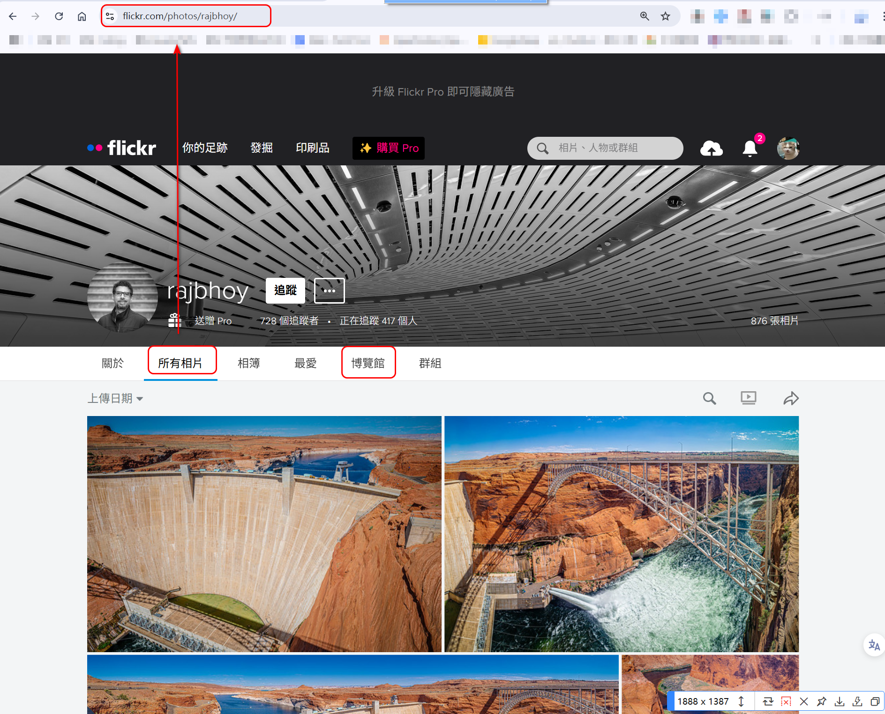

# flickr-img

1. 利用下列命令取得uv.exe工具
  - python -m pip install uv
2. 利用下面命令建立工作目錄project
  - uv init project
   打開google瀏覽器用下列命令找到google chrome的版本，根據版本號下載將webdriver的安裝包，然後解壓縮將其中的chrome.exe檔按複製到根目錄 (注意：本目錄使用為自己的google瀏覽器版本)
- chrome://version 
4. 使用下面命令編譯程式,這支程式為抓取“博覽館“和"所有相片"連結的圖片，(例如：到作者的"所有相片"，"博覽館"的取得連結) 
- uv run flickr-expo-v0.2.py

