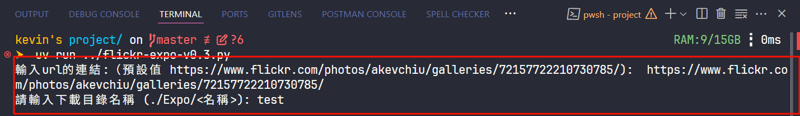

# flickr-img
### 這是一隻用來抓flickr圖片的程式，可以抓"博覽館"的圖片，下面是用vscode為例，在Terminal下示範如何編譯程式

1. 利用下列命令取得uv.exe工具
> python -m pip install uv
2. 利用下面命令建立工作目錄project
> uv init project
3. 打開google瀏覽器用下列命令找到google chrome的版本，根據版本號下載將webdriver的安裝包，然後解壓縮將其中的chrome.exe檔按複製到根目錄 (注意：本目錄使用為自己的google瀏覽器版本)
> chrome://version

4. 使用下面命令編譯程式,先進入工作目錄project
> cd project
5. 加入第三方套件
> uv add requests bs4 selenium
- 這支程式為抓取flickr的“所有相片"和"博覽館“連結的圖片，(例如：到作者的"所有相片"、"博覽館"的取得連結)

----
6. 輸入下面命令編譯 (for 博覽館)
> uv run ../flickr-expo-v0.2.py

